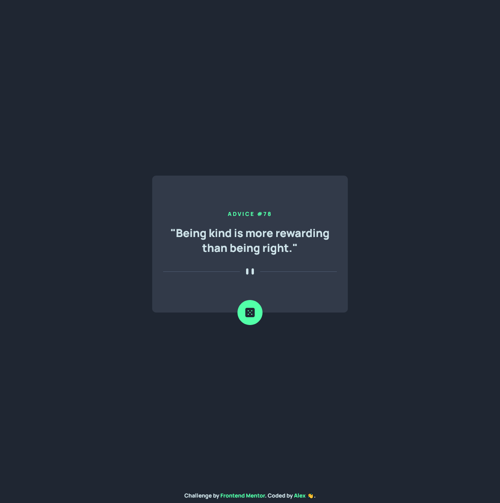
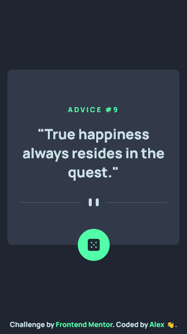

# Frontend Mentor - Advice generator app solution

This is a solution to the [Advice generator app challenge on Frontend Mentor](https://www.frontendmentor.io/challenges/advice-generator-app-QdUG-13db). Frontend Mentor challenges help you improve your coding skills by building realistic projects.

## Table of contents

- [Overview](#overview)
  - [The challenge](#the-challenge)
  - [Screenshot](#screenshot)
  - [Links](#links)
- [My process](#my-process)
  - [Built with](#built-with)
  - [What I learned](#what-i-learned)
  - [Continued development](#continued-development)
  - [Useful resources](#useful-resources)
- [Author](#author)

## Overview

### The challenge

Users should be able to:

- View the optimal layout for the app depending on their device's screen size
- See hover states for all interactive elements on the page
- Generate a new piece of advice by clicking the dice icon

### Screenshot




### Links

- Solution URL: [github repo](https://github.com/CallMe-AL/frontendmentor-advice-generator)
- Live Site URL: [github page](https://callme-al.github.io/frontendmentor-advice-generator/)

## My process

### Built with

- Semantic HTML5 markup
- CSS custom properties
- Flexbox
- Mobile-first workflow

### What I learned

This project was a nice refresher on the Fetch API, during which I learned how to turn off caching while making a Fetch request. Additionally, I learned how to use the picture element to responsively load html images, as well as the importance of always having an h1 element for accessibility purposes. I also practiced using the :root pseudo-class for css for the first time to create variables!

For example:

```css
:root {
  --light-cyan: hsl(193, 38%, 86%);
  --neon-green: hsl(150, 100%, 66%);
  --grayish-blue: hsl(217, 19%, 38%);
  --darkish-grayish-blue: hsl(217, 19%, 24%);
  --darkish-blue: hsl(218, 23%, 16%);
}
```

### Continued development

I'd like to continue practicing Fetch as much as possible to get more comfortable with it. I'd also like to keep learning how to make my projects more accesible for everyone, especially those using screen readers.

### Useful resources

- [Mozilla docs](https://developer.mozilla.org/en-US/docs/Web/API/Fetch_API/Using_Fetch#headers) - Always useful for referencing anything web dev. Here I used it to read more about Fetch.
- [Mozilla docs](https://developer.mozilla.org/en-US/docs/Web/CSS/:root) - Useful info about the :root element.

## Author

- Website - [My portfolio](https://callme-al.github.io/portfolio/)
- Frontend Mentor - [@CallMe-AL](https://www.frontendmentor.io/profile/CallMe-AL)
